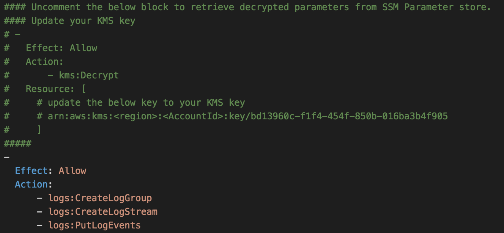

Lambda Amazon EC2 System Manager (SSM) Parameter Store Example
==============================================
This sample code helps you get started - how to retrieve configuration data and secrets stored in Amazon EC2 System Manager (SSM) Parameter Store. 
The AWS SAM template creates 3 lambda function with IAM policy and a couple of mock configuration data in SSM paramter store.

This sample includes:

* README.md - this file
* lambda_functions - this folder contains the sample Lambda functions.
* template.yaml - this file contains the Serverless Application Model (SAM) used
  by AWS Cloudformation that creates 3 Lambda functions, IAM roles & policy and a couple of mock configuration data in SSM paramter store.

Getting Started
---------------
1. Zip the js files and upload to S3 bucket. Update the S3 bucket name for `lambdaSSMgetparamFunction`, `lambdaSSMgetparamsFunction` and `lambdaSSMgetparamsWithDecryptionFunction` resources.

> Note: If you dont need to test the "SecureString" functionality of SSM Parameter store, skip step 2 and go to step 3

2. To test `lambda-ssm-getparams-with-decryption-function`, 

    - Use the AWS CLI to add "SecureString" parameters to SSM parameter store

    ```
    aws ssm put-parameter --name dbConnectionString --value <VALUE> --type SecureString --key-id <KMS key id> --region <REGION>

    aws ssm put-parameter --name dbUsername --value <USERNAME> --type SecureString --key-id <KMS key id> --region <REGION>

    aws ssm put-parameter --name dbPassword --value <PASSWORD> --type SecureString --key-id <KMS key id> --region <REGION>
    ```

    - Uncomment the following policy section in template.yaml and update KMS Key.
    

    - You also need to make sure `ssm:GetParameters` or `ssm:GetParameter` has the correct Allow policy to read the newly added paramters in SSM parameter store. Update the template.yaml file.

3. Deploy the solution using AWS SAM Template - template.yaml and test the lambda functions.

Articles
-----------
[Learn more about Serverless Application Model (SAM) and how it works](https://github.com/awslabs/serverless-application-model/blob/master/HOWTO.md)

[AWS Lambda Developer Guide](http://docs.aws.amazon.com/lambda/latest/dg/deploying-lambda-apps.html)

[Test Your Serverless Applications Locally Using SAM Local](http://docs.aws.amazon.com/lambda/latest/dg/test-sam-local.html)

[Amazon EC2 System Manager Parameter Store](https://aws.amazon.com/ec2/systems-manager/parameter-store/)
